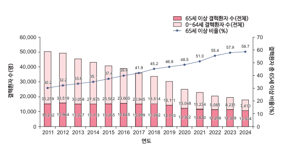
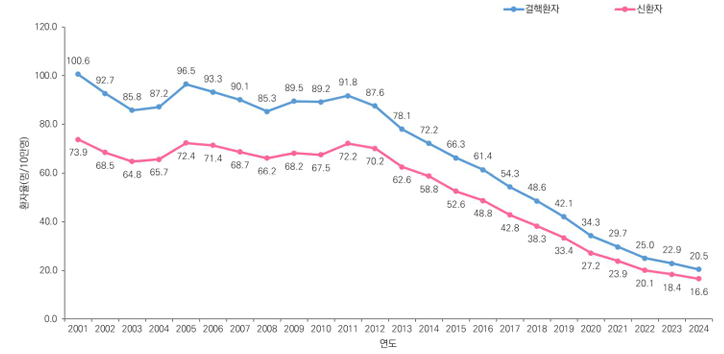
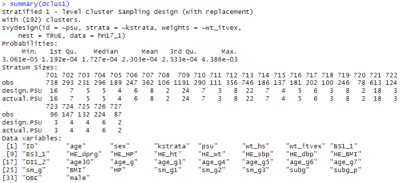
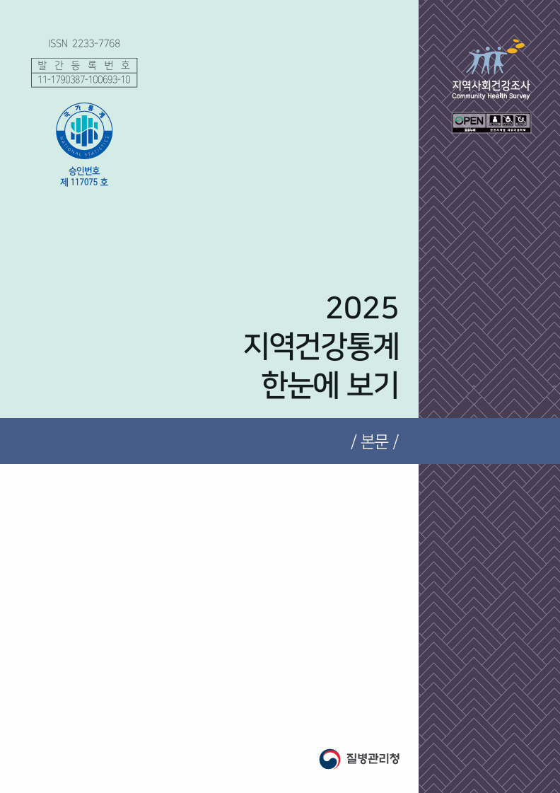
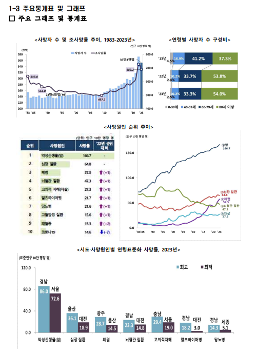

# 3. 공공데이터

## 3.1 질병관리청

### 3.1.1 결핵환자신고현황

#### 개요

결핵환자신고현황(이하 결핵신고DB)는 「감염병의 예방 및 관리에 관한 법률」에 따라 신고된 결핵 환자의 정보를 수집한 자료입니다. 국내 결핵 발생 현황을 정확히 파악하여 결핵 관리 정책의 기초 자료로 활용되며, 환자의 인적 사항부터 확진 시 검사 결과, 치료 경과까지 포함하고 있어 감염병 역학 연구에 핵심적인 데이터를 제공합니다.

#### 데이터 범위 및 최신성

- 확보 연도: 2013년 ~ 2024년
- 업데이트 주기: 연 1회(24년 DB의 경우 25년 3월 말 업로드)
- 규모: 24년 DB 신환자 14,412명, 누적 약 367,000명 (전수조사)

#### 데이터 형태 및 분석 환경

- 제공 형태: 텍스트 파일(.csv)
- 분석 언어/도구: SAS, SPSS, STATA, R <모든 언어의 기초코드 제공>
- 주요 변수 체계: 환자 기본정보, 진단 정보, 치료 정보
- 가중치/표본설계 정보: 해당 없음 (전수조사)

#### 데이터 획득 (난이도 – 하 ★☆☆)

- 성격: 정부지정통계(승인번호 제117107호)
- 설계: 전수조사(신고 기반)
- 단위: 개인 단위
- 방법: MDIS > 자료이용 > 다운로드서비스 > 보건 > 결핵환자신고현황, 신청 후 바로 다운로드 가능 (https://mdis.mods.go.kr/index.do)
- IRB 필요 여부: 필요 없음
- 비용: 무료
- 제한 변수: 이름, 주민등록번호, 상세 주소 등 식별 정보 비공개

#### 데이터 결합

- 개인단위 결합 가능 여부: 가능(보건의료 빅데이터 통합플랫폼을 통한 기관 간 가명정보 결합 지원)

#### 구성 <항목정의서 대체자료 존재(결핵환자신고현황_파일설계서)>

- 환자 기본정보: 성별, 연령, 거주지(시도 단위), 외국인 여부 등
- 진단 정보: 신고기관 유형, 진단일, 진단 시 도말/배양 검사 결과, 약제내성 검사 결과 등
- 치료 정보: 치료 시작일, 치료 결과(완치, 실패, 사망 등), 약제 처방 내역 등

#### 관련 연구

추후 업데이트 예정

#### Data preview

### 3.1.2 국민건강영양조사

#### 3.1.2.1 국민건강영양조사 기본 DB

##### 개요

국민건강영양조사(이하 국건영) 기본DB는 우리 국민의 건강 및 영양 상태를 파악하기 위해 질병관리청에서 실시하는 대표적인 국가 승인 통계자료입니다. 국건영은 전국 단위 확률 표본을 기반으로 건강설문조사, 검진조사, 영양조사를 실시하여 국민의 주요 보건지표를 산출하며, 1998년부터 수행되어 온 반복 단면 조사로 장기 시계열 데이터를 제공합니다.

##### 데이터 범위 및 최신성

- 확보 연도: 1998년 ~ 2024년
- 업데이트 주기: 연 1회*(24년 DB의 경우 12월 최종업로드) *1998~2005: 3년주기, 2007~: 1년 주기
- 규모: 24년 DB 9,814명, 누적 215,103명

##### 데이터 형태 및 분석 환경

- 제공 형태: SAS dataset (.sas7bdat) / SPSS file(.sav)
- 분석 언어/도구: SAS <코드 제공>, R, Python
- 주요 변수 체계: 설문/검진/영양 모듈 분리
- 가중치/표본설계 정보: 표본설계 가중치 제공 (분석시 설계 반영 필요)

##### 데이터 획득 (난이도 – 하 ★☆☆)

- 성격: 정부지정통계(승인번호 제117002호)
- 설계: 층화·집락·가중치 적용된 복합표본 설계
- 단위: 개인 단위(단면 반복조사)
- 방법: 질병관리청 국민건강영양조사 > 원시자료 > 다운로드, 신청 후 바로 다운로드 가능

(https://knhanes.kdca.go.kr/knhanes/main.do)

- IRB 필요 여부: 필요 없음
- 비용: 무료
- 제한 변수: 시·군·구 단위 세부 지역 정보 등 개인 식별 위험이 있는 민감 변수 비공개

##### 데이터 결합

- 연계자료 이용신청: 질병관리청 누리집을 통해 타 공공기관 자료와 연계된 특수 목적 DB 신청 가능
- 사망원인통계: 국건영 대상자의 사망 여부 및 원인 정보 연계
- 대기오염DB: 거주지역별 대기오염 노출 농도 정보 연계
- 학술연구자료 신청: 제한공개자료(조사일, 조사지역)가 포함된 연구용 자료 신청 지원
- 개인단위 결합 가능 여부: 가능 (보건의료 빅데이터 통합플랫폼을 통한 기관 간 가명정보 결합 지원)

##### 구성

- 건강설문조사: 인구사회학적 특성, 질병 이력, 의료이용, 건강행태
- 검진조사: 신체계측, 혈압, 혈액·소변 검사 결과
- 영양조사: 식품섭취조사, 영양소 섭취량

##### 관련 연구

추후 업데이트 예정

##### Data preview

#### 3.1.2.2 대기오염 DB

##### 개요

국민건강영양조사(이하 국건영) 대기오염 연계 DB는 국건영 참여자의 거주지 정보와 인근 측정망의 대기오염 농도 자료를 연계한 특수 목적 데이터셋입니다. 미세먼지(PM10, PM2.5), 이산화질소(NO2) 등 주요 대기오염 물질 노출량과 개별 건강 지표를 결합하여 환경 보건 연구를 수행할 수 있도록 지원합니다.

##### 데이터 범위 및 최신성

- 확보 연도: 2007년 ~ 2022년 *대기오염 물질별로 확보 시작 연도가 상이함
- 업데이트 주기: 비정기적(기본 DB 확정 후 대기오염 농도 매칭 및 가공 작업 거쳐 공개)

※기본 DB 확정 후 대기오염 농도 매칭 및 가공 과정으로 인한 약 1~2년의 시차 발생

- 규모: 22년 DB 6,265명, 누적(07~22) 약 125,000명 (연계 성공 대상자 기준)

##### 데이터 형태 및 분석 환경

- 제공 형태: SAS dataset(.sas7bdat), SPSS(.sav)
- 분석 언어/도구: SAS, R, Python
- 주요 변수 체계: 국건영 기본 변수 + 대기오염 물질별 노출량(일평균, 월평균, 연평균 등)
- 가중치/표본설계 정보: 국건영 기본DB의 복합표본 설계 가중치 활용 필수

##### 데이터 획득 (난이도 – 중 ★★☆)

- 유형: (국건영-환경 데이터 결합본)
- 성격: 환경보건 연구를 위한 특수 목적 연계 DB
- 설계: 국건영 대상자의 지리적 위치 정보를 활용한 시공간적 노출 농도 추정법 적용
- 단위: 개인 단위 (위치 기반 연계자료)
- 방법: 질병관리청 국민건강영양조사 > 원시자료 > 연계자료, 신청 후 바로 다운로드 가능

(https://knhanes.kdca.go.kr/knhanes/main.do)

- IRB 필요 여부: 필요 없음
- 비용: 무료
- 제한 변수: 읍·면·동 단위 주소 정보 자체는 비공개이며, 결합된 '농도 값' 형태로만 제공됨

##### 데이터 결합

- 연계자료 이용신청: 기본 DB 원시자료를 반드시 함께 획득해야 함
- 사망원인 연계자료: 대기오염 노출 농도에 따른 특정 질환 사망 위험도(HR) 분석 가능
- 기상청 기상 관측 자료: 온도, 습도 등 기상 요인을 추가하여 대기오염의 건강 영향에 대한 보정 연구 가능
- 학술연구자료 신청: 질병관리청 누리집을 통해 연구계획서 승인 후 제공 (즉시 다운로드 불가)
- 개인단위 결합 가능 여부: 가능 (보건의료 빅데이터 통합플랫폼을 통해 국민건강보험공단 진료 내역과 결합 시, 대기오염 노출이 실제 병원 이용 및 의료비에 미치는 영향까지 확장 연구 가능)

##### 구성

- 대기오염 항목: 미세먼지(PM10, PM2.5), 이산화질소(NO2), 아황산가스(SO2), 일산화탄소(CO), 오존(O3)
- 노출 지표: 조사 시점 기준 단기/중기/장기 평균 노출량

##### 관련 연구

추후 업데이트 예정

##### Data preview

> '국건영 대상자별 미세먼지 노출 농도와 건강검진 결과값 결합 테이블 구조 예시'

### 3.1.3 급성심장정지조사

#### 개요

급성심장정지조사 데이터는 119 구급대에 의해 이송된 급성심장정지 환자의 발생 규모, 생존율, 치료 결과 등을 파악하기 위해 질병관리청에서 수행하는 국가 승인 통계자료입니다. 구급대 이송 기록과 병원 진료 기록을 통합하여 심장정지 환자의 전 과정을 추적 관리합니다.

#### 데이터 범위 및 최신성

- 확보 연도: 2008년 ~ 2024년
- 업데이트 주기: 연 1회(24년 DB의 경우 26년 2월 최종 업로드)
- 규모: 24년 DB 약 3.3만건, 누적 약 55만건 (전수조사)

#### 데이터 형태 및 분석 환경

- 제공 형태: SAS dataset(.sas7bdat), SPSS(.sav), Excel file(.xlsx)
- 분석 언어/도구: SAS, R, Python
- 주요 변수 체계: 발생 장소, 원인, 심폐소생술 시행 여부, 생존 결과 등
- 가중치/표본설계 정보: 해당 없음 (전수조사)

#### 데이터 획득 (난이도 – 중 ★★☆)

- 성격: 국가 승인 통계(제117088호)
- 설계: 전국 119구급대 및 의료기관 기반 전수조사
- 단위: 사건(Case) 단위
- 방법: 국가손상정보포털 > 자료실 > 원시자료신청, 소관부서 심사 후 승인/반려

(https://mdis.mods.go.kr/index.do / MDIS에서도 다운로드 가능)

- IRB 필요 여부: 질병관리청 IRB 승인 데이터로, 연구자 소속기관 IRB 심의 권고
- 비용: 무료
- 제한정보: 성명, 주민번호 등 개인식별정보 및 이송 구급대·의료기관 명칭, 상세 발생지(시군구 이하) 등 비공개

#### 데이터 결합

- 연계자료 이용신청: 해당 없음

#### 구성

- 발생 전 상황: 심장정지 인지 시점, 목격자 여부
- 구급대 활동: 현장 도착 시간, 현장 심폐소생술 및 제세동 시행 여부
- 병원 내 처치: 응급실 처치, 최종 생존 상태 및 뇌기능 결과(CPC score)

#### 관련 연구

추후 업데이트 예정

#### Data preview

> '119 구급활동(현장 처치) → 응급실 이송 → 병원 내 가료 → 생존 퇴원/사망 결과로 이어지는 단계별 데이터 수집 체계도’
> '일반인 심폐소생술 시행률 추이' 또는 '심장정지 발생 장소별 비중' 차트
> summary()
> info()
> \| 발생 정보 \| PLACE_TYPE \| 발생 장소 (공공장소, 비공공장소 등) \|
> \| 목격자 정보 \| WITNESS \| 목격자 여부 및 일반인 CPR 시행 여부 \|
> \| 구급대 정보 \| ROSC_PRE \| 병원 도착 전 자발순환 회복 여부 \|
> \| 병원 결과 \| SURVIVAL \| 생존 퇴원 여부 (0:사망, 1:생존) \|
> \| 예후 정보 \| CPC_SCORE \| 퇴원 시 뇌기능 상태 (1:양호 ~ 5:사망) \|

### 3.1.4 예방접종 DB

#### 개요

예방접종 DB는 「감염병의 예방 및 관리에 관한 법률」에 따라 실시된 국가예방접종(NIP) 및 기타 예방접종 기록을 관리하는 데이터입니다. 전 국민의 백신별 접종 이력, 접종 시기, 접종 기관 정보를 포함하고 있어 백신의 면역 효과 분석, 접종률 추이 연구 및 이상반응 역학조사에 필수적인 기초 자료입니다.

#### 데이터 범위 및 최신성

- 확보 연도: 2002년 ~ 2024년
- 업데이트 주기: 연 1회 (24년 DB의 경우 25년 12월 최종 업로드)
- 규모: 24년 접종 건수 약 3,500만 건, 누적 약 5억 건 이상 (전수조사)

#### 데이터 형태 및 분석 환경

- 제공 형태: SAS dataset(.sas7bdat), CSV file(.csv)
- 분석 언어/도구: SAS, R, Python
- 주요 변수 체계: 백신 종류, 접종 차수, 접종 일자, 접종 기관 특성
- 가중치/표본설계 정보: 해당 없음 (전수조사)

#### 데이터 획득 (난이도 – 중 ★★☆)

- 제공기관: 질병관리청 (질병보건통합관리시스템)
- 성격: 행정 등록 데이터 기반 연구 DB
- 설계: 예방접종 통합관리시스템 기반 전수조사
- 단위: 접종 건 단위 / 개인 단위 연계 가능
- 방법: 질병보건통합관리시스템을 통해 원시자료 이용 신청 및 연구계획서 제출 → 심의 승인 후 제공 (https://is.kdca.go.kr/)
- IRB 필요 여부: 필수 (개인별 접종 이력이 포함된 마이크로데이터이므로 소속기관 IRB 승인 필요)
- 비용: 무료
- 제한정보: 개인식별정보(성명, 상세주소) 및 특정 의료기관 명칭 비공개

#### 데이터 결합

- 연계자료 이용신청: 질병관리청 내 타 감염병 DB와의 연계 지원
- 이상반응 연계자료: 특정 백신 접종 후 신고된 이상반응 사례와의 매칭 데이터 신청 가능
- 학술연구자료 신청: 연구 목적에 따라 특정 백신(예: 코로나19, HPV) 접종군에 특화된 상세 데이터셋 지원

#### 구성

- 대상자 정보: 성별, 연령대, 거주지역(시도 단위)
- 접종 정보: 백신 코드, 백신 제조사, 접종 차수, 접종 연월일
- 기관 정보: 의료기관 종별(의원, 병원 등), 소재지

#### 관련 연구

추후 업데이트 예정

#### Data preview

> '백신 종류별 연도별 접종 건수 추이' 막대 그래프
> '생애주기별 필수 예방접종 타임라인'
> summary()
> info()
> VAC_CD: 백신 종류 코드
> VAC_DEGREE: 접종 차수 (1차, 2차 등)
> VAC_DATE: 실제 접종일
> ORG_TYPE: 접종 시행 기관 구분

### 3.1.5 응급실손상환자심층조사

#### 개요

응급실손상환자심층조사는 손상으로 인해 응급실에 내원한 환자를 대상으로 손상 발생 원인, 장소, 활동 등 상세한 경위를 조사한 자료입니다. 질병관리청이 지정한 전국 20여 개 참여 병원 응급실을 통해 수집되며, 국가 손상 예방 정책 수립 및 안전 가이드라인 개발의 기초 자료로 활용됩니다.

#### 데이터 범위 및 최신성

- 확보 연도: 2006년 ~ 2024년
- 업데이트 주기: 연 1회 (24년 DB의 경우 12월 최종 업로드)
- 규모: 24년 DB 약 28만 건, 누적 약 400만 건 이상 (조사 참여 병원 전수

#### 데이터 형태 및 분석 환경

- 제공 형태: SAS dataset(.sas7bdat), CSV file(.csv)
- 분석 언어/도구: SAS, R, Python
- 주요 변수 체계: 손상 기전(추락, 운수사고 등), 손상 발생 시 활동, 의도성 여부, 손상 결과
- 가중치/표본설계 정보: 국가 대표성을 확보하기 위한 층화 가중치 포함

#### 데이터 획득 (난이도 – 하 ★☆☆)

- 유형: 정형 데이터
- 성격: 국가 승인 통계(제117054호)
- 설계: 표집된 23개 대학병원 및 의료기관 응급실 기반 심층 조사
- 단위: 사건(Case) 단위
- 방법: 질병관리청 손상정보포털 내 원시자료 신청 메뉴에서 서약서 제출 후 즉시 다운로드 (https://www.kdca.go.kr/injury/)
- IRB 필요 여부: 질병관리청 IRB 승인 완료 데이터로 소속기관 IRB 면제
- 비용: 무료
- 제한정보: 개인 식별정보(성명, 상세주소) 및 특정 의료기관 명칭 비공개

#### 데이터 결합

- 연계자료 이용신청: 손상정보포털 내 타 심층조사와 연계 분석 권장
- 특정 손상 기전(교통사고 등)에 특화된 심층 자료와 결합 지원
- 학술연구자료 신청: 원시자료 외에 특정 연도별/항목별 통계 가공 서비스 지원

#### 구성

- 일반 정보: 성별, 연령, 내원 일시, 내원 수단
- 손상 내용: 손상 발생 일시, 장소, 유발 물질(객체), 손상 부위 및 양상
- 심층 항목: 의도성(자해/타해 여부), 음주 여부, 안전벨트/헬멧 착용 여부
- 진료 결과: 응급실 진료 결과(귀가/입원), 입원 후 결과(생존/사망)

#### 관련 연구

추후 업데이트 예정

#### Data preview

> '손상 기전별(추락, 미끄러짐, 충돌 등) 발생 비중' 인포그래픽
> summary()
> info()
> INJ_MECH: 손상 기전 코드
> INJ_PLACE: 손상 발생 장소(거실, 도로, 공사장 등)
> INTENT: 손상 의도성(의도적 자해, 비의도적 사고 등)
> ALCOHOL: 사고 당시 음주 여부

### 3.1.6 지역사회건강조사(CHS)

#### 개요

지역사회건강조사 DB는 질병관리청과 전국 258개 보건소가 주관하며, 「지역보건법」에 따라 지역 주민의 건강 실태를 파악하여 밀착형 보건 의료계획 수립 및 평가를 위한 근거 데이터를 제공합니다.

#### 데이터 범위 및 최신성

- 확보 연도: 2008년 ~ 2024년
- 업데이트 주기: 연 1회 (보통 익년 1분기 원시자료 공개)
- 규모: 매년 약 23만 명 (전국 단위 통합 분석 및 지역 간 비교 가능)

#### 데이터 형태 및 분석 환경

- 제공 형태: SAS dataset(.sas7bdat), TXT file(.txt)
- 분석 언어/도구: SAS, R, Python, SPSS
- 주요 변수 체계: 건강행태(흡연, 음주), 만성질환 이환(고혈압, 당뇨), 손상, 삶의 질(EQ-5D), 의료이용
- 가중치/표본설계 정보: 복합표본설계 변수(층화, 집락, 가중치) 적용 필수

#### 데이터 획득 (난이도 – 하 ★☆☆)

- 성격: 가구 방문 면접 조사 기반 데이터
- 설계: 전국 258개 시·군·구 보건소별 약 900명 표본 (계통추출법)
- 단위: 개인 단위
- 방법: 지역사회건강조사 누리집에서 원시자료 이용신청서 및 서약서 제출 → 즉시 또는 단기간 내 승인 후 다운로드 (https://chs.kdca.go.kr/chs/)
- IRB 필요 여부: 연구용 사용 시 권장 (공공데이터로 면제 승인 용이)
- 비용: 무료
- 제한정보: 읍·면·동 단위 이하의 상세 지역 정보 및 개인 식별 정보 비공개

#### 데이터 결합

- 연계자료 이용신청: 연계자료 이용신청: 통계청 가상번호를 활용한 타 기관(국민건강보험공단 등) 데이터와의 연계 연구 가능 (별도 심의)
- 지역사회건강-국민건강보험공단 연계 DB: 지역사회건강조사 응답자의 건강행태 데이터와 국민건강보험공단의 진료/검진 내역을 결합한 연구용 데이터셋 신청 가능
- 학술연구자료 신청: 누리집을 통해 원시자료(마이크로데이터) 및 연도별 통합자료 제공

#### 구성 <항목정의 대체자료 존재(원시자료이용지침서)>

- 건강행태: 현재 흡연 여부, 고위험 음주율, 걷기 실천율, 영양 표시 독해 여부
- 이환관리: 고혈압/당뇨병 의사 진단 경험 및 약물 복용 여부, 안저검사 수신율
- 심리사회: 우울감 경험률, 스트레스 인지율, 주관적 건강 수준

#### 관련 연구

추후 업데이트 예정

#### Data preview

> '시도별 걷기 실천율 및 비만율 상관관계' 산점도
> '연도별 만성질환 관리율 추이' 라인 차트
> summary()
> info()
> EX_WALK_DAYS: 최근 1주일간 1일 30분 이상 걷기 일수
> DIAB_DIAG: 당뇨병 의사 진단 여부
> WT_AVG: 분석용 복합표본 가중치

### 3.1.7 지역사회기반 중증외상조사

#### 개요

지역사회기반 중증외상조사 DB는 질병관리청과 소방청이 협력하여 구축하며, 중증외상 환자의 발생부터 이송, 응급실 진료, 최종 치료 결과까지 전 과정을 추적하여 국가 손상 예방 및 외상 진료 체계 개선에 활용됩니다.

#### 데이터 범위 및 최신성

- 확보 연도: 2012년 ~ 2024년
- 업데이트 주기: 연 1회
- 규모: 연간 약 3만 명 내외의 중증외상 사례

#### 데이터 형태 및 분석 환경

- 제공 형태: SAS dataset(.sas7bdat), CSV file(.csv)
- 분석 언어/도구: SAS, R, Python, SPSS
- 주요 변수 체계: 손상 기전(추락, 교통사고 등), 사고 장소, 구급차 내 처치, ISS(손상중증도점수), 치료 결과(사망/생존)
- 가중치/표본설계 정보: 전수조사 성격이 강하나 연도별 보정치 확인 필요

#### 데이터 획득 (난이도 – 중 ★★☆)

- 유형: 정형 데이터
- 성격: 구급활동 및 의무기록 기반 추적 조사 데이터
- 설계: 중증외상 환자 및 다수사상 사고 대상 전수 조사
- 단위: 사건/개인 단위
- 방법: 질병관리청 국가손상정보포털에서 신청 → 연구 계획서 심의 → 데이터 제공

(https://www.kdca.go.kr/injury/)

- 질병관리청 IRB 승인 완료 데이터(소속기관 IRB 면제/권고 사항)
- 비용: 무료
- 제한정보: 사고 발생 상세 지점, 의료기관 식별 정보 등 민감 정보 제한

#### 데이터 결합

- 연계자료 이용신청: 소방청-응급의료기관-질병관리청 간 연계된 통합 외상 DB 제공
- 사고 현장의 구급 활동 일지와 병원의 중증외상 조사 자료가 결합된 형태의 데이터 신청 가능
- 개인단위 결합 가능 여부: 가능 (국가 손상조사감시체계 데이터 결합 지원)

#### 구성

- 손상 기전(Blunt/Penetrating), 의도성 여부, 사고 시 활동(업무/여가)
- 임상지표: 초기 활력징후(SBP, RR, GCS), 손상 부위별 AIS 점수, 최종 ISS 점수
- 치료결과: 응급실 결과, 중환자실 체류 일수, 퇴원 시 기능 상태(GOS/mRS)

#### 관련 연구

추후 업데이트 예정

#### Data preview

> '연령대별 손상 기전 분포' 파이 차트
> '이송 시간대별 사망률 분석' 히트맵
> summary()
> info()
> INJ_MECHANISM: 손상 기전 코드 (1: 교통사고, 2: 추락 등)
> ISS_SCORE: Injury Severity Score (손상 중증도 점수)
> OUTCOME_STATUS: 최종 생존 상태

### 3.1.8 퇴원손상심층조사

#### 개요

퇴원손상심층조사는 질병관리청에서 의료기관 퇴원환자의 의무기록을 바탕으로 질병 및 손상 양상을 파악하는 조사입니다. 전국의 100병상 이상 일반병원 중 표본으로 선정된 의료기관을 대상으로 하며, 국민의 입원 유병률 및 손상 발생 규모를 파악하여 만성질환 및 손상 예방 정책의 기초 자료로 활용됩니다.

#### 데이터 범위 및 최신성

- 확보 연도: 2005년 ~ 2024년
- 업데이트 주기: 연 1회 (24년 DB의 경우 12월 최종 업로드)
- 규모: 24년 DB 약 25만 건, 누적 약 380만 건 이상 (표본 추출 기반)

#### 데이터 형태 및 분석 환경

- 제공 형태:SAS dataset(.sas7bdat), CSV file(.csv)
- 분석 언어/도구: SAS, R, Python
- 주요 변수 체계: 주진단/부진단(ICD-10), 손상외인, 수술/처치여부, 입원 및 퇴원 경로
- 가중치/표본설계 정보: 국가 전체 입원 환자 수를 추정하기 위한 복합표본 가중치 포함

#### 데이터 획득 (난이도 – 하 ★☆☆)

- 성격: 국가 승인 통계(제117051호)
- 설계: 100병상 이상 일반병원 표본(매년 약 200여 개소) 퇴원환자 추출조사
- 단위: 사건(Case) 단위 / 퇴원환자 단위
- 방법: 질병관리청 손상정보포털 내 신청서 제출 후 즉시 다운로드

(https://www.kdca.go.kr/injury/)

- IRB 필요 여부: 질병관리청 IRB 승인 완료 데이터(소속기관 IRB 면제/권고 사항)
- 비용: 무료
- 제한정보: 개인 식별정보(성명, 상세주소) 및 특정 의료기관(병원명) 정보 비공개

#### 데이터 결합

- 연계자료 이용신청: 입원환자 중 손상으로 인한 퇴원자만 추출한 연계 자료 제공
- 입원환자 중 손상으로 인한 퇴원자만 추출한 연계 자료 제공
- 학술연구자료 신청: 다년도 통합 분석을 위한 연도별 가변수 매칭 가이드 지원

#### 구성

- 환자 정보: 성별, 연령, 거주지(시도), 건강보험 종별
- 진료 정보: 입원일, 퇴원일, 재원일수, 주상병/부상병(최대 20개), 수술/처치여부
- 손상 정보: 손상 외인 코드(원인), 손상 발생 장소, 손상 시 활동
- 결과 정보: 퇴원 형태(귀가, 전원, 사망), 입원 경로(외래, 응급실)

#### 관련 연구

추후 업데이트 예정

#### Data preview

> '주요 상병군별 평균 재원일수 비교' 차트
> '퇴원환자 입원 경로 비중' 원형 그래프
> summary()
> info()
> ADMISS_DATE / DISCH_DATE: 입퇴원 일자
> DIAG_CODE: 주진단명 (KCD/ICD-10)
> INJ_CAUSE: 손상 원인 코드
> DISCH_RESULT: 퇴원 후 결과 (정상퇴원, 전원 등)

## 3.2 국가데이터처

### 3.2.1 사망원인정보 DB

#### 개요

사망원인정보 DB는 「가족관계의 등록 등에 관한 법률」에 따라 신고된 사망신고서와 의료기관의 사망진단서 등을 토대로 작성되는 국가 승인 통계입니다. 우리나라 국민의 사망 수준, 사망 원인 및 추이를 파악할 수 있는 가장 정확한 자료이며, 암·심혈관질환 등 주요 질환의 예후 연구 및 기대수명 산출의 기초가 됩니다.

#### 데이터 범위 및 최신성

- 확보 연도: 1997년 ~ 2024년
- 업데이트 주기: 연 1회 (24년 DB의 경우 25년 12월 최종 업로드)
- 규모: 24년 사망자 약 35만 명, 누적 약 1,200만 명 이상 (전수조사)

#### 데이터 형태 및 분석 환경

- 제공 형태: SAS dataset(.sas7bdat), CSV file(.csv), TXT file(.txt)
- 분석 언어/도구: SAS. SPSS, STATA, R, Python
- 주요 변수 체계: 사망 일시, 사망 장소, 사망 원인(ICD-10 코드), 인구학적 특성
- 가중치/표본설계 정보: 해당 없음 (전수조사)

#### 데이터 획득 (난이도 – 중 ★★☆)

- 성격: 정부지정통계(승인번호 제101003호)
- 설계: 전 국민 사망 전수조사
- 단위: 개인 단위(사망자 기준)
- 방법: MDIS 홈페이지 접속 → 로그인 → '자료이용' → 사망원인통계 선택 → 항목 선택 → 추출 후 자료 획득

(https://mdis.mods.go.kr/)

- 비용: 무료 (신청 항목 및 규모에 따라 상이)
- 제한정보: 성명, 주민번호 등 개인식별정보 및 상세 주소(시군구 이하) 비공개

#### 데이터 결합

- 연계자료 이용신청: 국가데이터처 자체적으로 타 기관 데이터와의 결합 DB 제공
- 사망원인-인구동태 연계자료: 출생, 혼인, 이혼 정보와 사망 정보를 연계한 생애주기 분석 데이터 지원
- 연계 시 IRB 및 DRB 승인 필요할 수 있다
- 학술연구자료 신청: 연구 목적에 따라 특정 사인(예: 특정 암종, 외인사) 환자군만 추출한 상세 연구용 자료 신청 가능
- 개인단위 결합 가능 여부: 가능 (보건의료 빅데이터 통합플랫폼을 통한 기관 간 가명정보 결합 지원)

#### 구성

- 인구학적 특성: 성별, 사망 당시 연령, 거주지, 교육 수준, 직업
- 사망 정보: 사망 연월일시, 사망 장소(병원, 자택 등)
- 사인 정보: 직접 사인, 중간 사인, 선행 사인, 최종 확정 사인(ICD-10 코드)

#### 관련 연구

추후 업데이트 예정

#### Data preview

> 출처 : 이용자용 통계정보보고서_사망원인통계_2024

## 3.3 국민건강보험공단

### 3.3.1 국민건강정보데이터(표본연구DB)

#### 개요

연구목적에 적합한 인구집단을 표본으로 추출하고, 개인을 직접 알아볼 수 없도록 가명처리한 후 주제별로 규격화한 데이터입니다.

표본연구DB는 연구자가 대상자를 처음부터 직접 추출하는 맞춤형연구 DB와 달리, 공단이 미리 정한 표본설계와 데이터 구조에 따라 구축된 고정형 코호트입니다. 동일한 가명 개인식별자를 이용해 자격, 진료, 건강검진, 요양기관 및 노인장기요양 자료를 연도별로 연결할 수 있어 질병 발생, 의료이용, 치료경로, 의료비 및 장기요양 이용을 장기간 추적하는 연구에 활용됩니다.

#### 데이터 범위 및 최신성

- 표본코호트 DB 2.0은 2006년 기준 약 100만 명을 추출해 2002~2019년 자료를 제공한 공개 버전이 최신 버전이다.
- 코호트별 수록 기간·대상·갱신 여부가 다르므로 신청 시점의 NHISS 공고와 사용자 매뉴얼확인 필요하다.

#### 데이터 형태 및 분석 환경

- 개인식별정보를 가명처리한 관계형 테이블로 제공되며, 연구자는 공단의 지정 분석환경에서 분석 가능.
- 진료·건강검진·자격 등 테이블은 개인대체키와 기준연도를 이용해 코호트 안에서 연결.

#### 데이터 획득 (난이도 – 중 ★★☆)

- NHISS에서 연구계획서와 변수목록을 제출하고 연구 적정성 심의·승인 및 비용 납부 후 이용 가능
- 신청 경로: https://nhiss.nhis.or.kr/

#### 데이터 결합

- 표본연구DB 내부 테이블은 제공된 대체키로 결합할 수 있습니다.
- 외부자료와의 개인 단위 연계는 별도 결합 절차와 추가 심의가 필요하며 일반 다운로드 방식으로 수행하지 않습니다.

#### 구성

- 주요 구성: 자격·보험료, 진료 명세서·진료내역·상병·처방, 건강검진, 요양기관, 노인장기요양 테이블.
- 코호트마다 사용할 수 있는 테이블과 변수 범위가 다릅니다.

#### 관련 연구

추후 업데이트 예정

#### Data preview

추후 업데이트 예정

#### 3.3.1.1 국민건강정보데이터(건강검진코호트DB)

##### 개요

2002~2003년 국민건강보험공단 일반건강검진 수검자 가운데 당시 40∼79세였던 사람의 약 10%인 514,866명​을 표본으로 선정하여 구축한 장기추적 코호트입니다.

표본대상자의 일반건강검진 결과를 건강보험 자격, 진료·처방, 요양기관 및 사망 관련 자료 등과 연결할 수 있도록 구성되어 있습니다. 동일 대상자가 건강검진을 반복해서 받은 경우 검진시점별 자료를 연결할 수 있어 혈압, 체질량지수, 혈당, 콜레스테롤 및 생활습관의 변화와 이후 질환 발생이나 의료이용 간의 연관성을 분석할 수 있습니다.

##### 데이터 범위 및 최신성

- 사용자 매뉴얼 v2.3 기준 대상자는 514,866명이며 2002~2023년 자료를 수록.
- 갱신 범위는 최신 공고에서 확인 가능.

##### 데이터 형태 및 분석 환경

- 자격, 진료, 건강검진, 요양기관, 사망연월·사망원인 등으로 구성된 가명처리 관계형 데이터입니다.
- 공단 지정 분석환경에서 SAS·R 등 승인된 도구를 사용합니다.

##### 데이터 획득 (난이도 – 중 ★★☆)

- NHISS를 통한 과제 신청, 심의, 이용계약 및 분석센터 이용 절차가 적용됩니다.

신청 경로: https://nhiss.nhis.or.kr/

##### 데이터 결합

- 코호트 내 자격·진료·검진 테이블은 개인대체키로 연결합니다.
- 외부자료 연계는 별도의 가명정보 결합·반출 심의를 거칩니다. 비용납부가 필요할 수 있다

##### 구성

- 핵심 테이블: 자격 및 보험료, 건강검진 문진·계측·검사, 진료명세서·상병·처방, 요양기관.
- 사망정보의 제공 범위와 최신성은 신청 버전에 따라 확인합니다.

##### 관련 연구

추후 업데이트 예정

##### Data preview

추후 업데이트 예정

#### 3.3.1.2 국민건강정보데이터(노인코호트DB)

##### 개요

노인코호트DB는 2002년 기준 만 60세 이상 건강보험 가입자와 의료급여 수급권자 약 550만 명 가운데 10%를 단순무작위로 추출한 558,147명​을 대상으로 구축한 고령 인구 특화 장기추적 코호트입니다.

건강보험 자격, 의료기관 이용, 진단·처치·약제처방, 건강검진 및 사망 관련 자료뿐만 아니라 2008년 도입된 노인장기요양보험의 신청, 인정조사, 등급판정 및 급여이용 자료를 함께 분석할 수 있도록 구성되어 있습니다.

##### 데이터 범위 및 최신성

- 사용자 매뉴얼 v1.3 기준 약 51만 명 규모이며 건강보험 자료는 2002~2023년, 노인장기요양 자료는 2008~2023년을 수록합니다.
- 버전 2.0은 비교표에 따른 층화표본과 매년 신규 60세 진입자를 반영합니다.

##### 데이터 형태 및 분석 환경

- 자격·진료·건강검진·요양기관·노인장기요양을 연결한 가명처리 관계형 데이터입니다.
- 공단 지정 분석환경에서 분석합니다.

##### 데이터 획득 (난이도 – 중 ★★☆)

- 연구계획 제출 및 심의 승인과 분석센터 이용 승인이 필요합니다. 비용납부가 필요할 수 있다
- 신청 경로: https://nhiss.nhis.or.kr/

##### 데이터 결합

- 코호트 내 건강보험과 장기요양 테이블은 제공된 대체키로 연결합니다.
- 외부자료와의 연계는 별도 결합 승인 대상입니다.

##### 구성

- 주요 구성: 자격, 진료, 건강검진, 요양기관, 장기요양 신청·인정조사·청구·시설 현황.

##### 관련 연구

추후 업데이트 예정

##### Data preview

추후 업데이트 예정

#### 3.3.1.3 국민건강정보데이터(자격 DB)

##### 개요

자격 DB는 표본연구DB와 맞춤형연구DB를 구성하는 기본 테이블로, 연구대상자가 특정 시점에 건강보험 가입자, 피부양자 또는 의료급여 수급권자였는지를 확인할 수 있는 자격·사회경제 정보입니다.

연구대상자의 연도별 또는 월별 건강보험 자격상태와 보험료 부과정보를 이용해 관찰대상 기간을 설정하고, 가입자격 변동, 소득수준, 거주지역 및 사망 등에 따른 대상자 특성을 정의할 수 있습니다.

##### 데이터 범위 및 최신성

- 수록 연도와 대상은 선택한 코호트 또는 맞춤형 과제의 승인 범위에 따라 달라집니다.
- 단독 상품으로 보기보다 연구DB 안에서 선택하는 구성 테이블로 이해해야 합니다.

##### 데이터 형태 및 분석 환경

- 가명처리된 행·열형 관계형 테이블이며 개인·요양기관 대체키와 기준연도를 사용합니다.
- 공단 지정 분석환경에서 이용합니다.

##### 데이터 획득 (난이도 – 중 ★★☆)

- NHISS 과제 신청 시 필요한 테이블과 변수를 명시합니다. 비용납부가 필요할 수 있다
- 신청 경로: https://nhiss.nhis.or.kr/

##### 데이터 결합

- 동일 승인 과제 안의 다른 건강보험 테이블과 대체키로 결합합니다.
- 외부기관 자료 결합은 별도 가명정보 결합 및 심의 절차가 필요합니다.

##### 구성

- 주요 항목: 성별, 연령대, 지역, 가입자 구분, 자격 취득·상실, 보험료·소득분위, 장애·사망 관련 제공항목.

##### 관련 연구

추후 업데이트 예정

##### Data preview

추후 업데이트 예정

#### 3.3.1.4 국민건강정보데이터(진료 DB)

##### 개요

진료 DB는 건강보험 또는 의료급여가 적용된 진료에 대해 요양기관이 국민건강보험공단에 비용을 청구한 내역을 연구용으로 구성한 테이블입니다. 표본연구DB와 맞춤형연구DB에서 질병 발생, 의료이용, 치료 및 비용을 분석하는 핵심 자료입니다.

##### 데이터 범위 및 최신성

- 수록 연도와 대상은 선택한 코호트 또는 맞춤형 과제의 승인 범위에 따라 달라집니다.
- 단독 상품으로 보기보다 연구DB 안에서 선택하는 구성 테이블로 이해해야 합니다.

##### 데이터 형태 및 분석 환경

- 가명처리된 행·열형 관계형 테이블이며 개인·요양기관 대체키와 기준연도를 사용합니다.
- 공단 지정 분석환경에서 이용합니다.

##### 데이터 획득 (난이도 – 중 ★★☆)

- NHISS 과제 신청 시 필요한 테이블과 변수를 명시합니다. 비용납부가 필요할 수 있다.
- 신청 경로: https://nhiss.nhis.or.kr/

##### 데이터 결합

- 동일 승인 과제 안의 다른 건강보험 테이블과 대체키로 결합합니다.
- 외부기관 자료 결합은 별도 가명정보 결합 및 심의 절차가 필요합니다.

##### 구성

- 주요 테이블: 명세서(20t), 진료내역(30t), 상병내역(40t), 처방전교부상세(60t) 및 요양기관 유형별 세부 테이블.

##### 관련 연구

추후 업데이트 예정

##### Data preview

추후 업데이트 예정

#### 3.3.1.5 국민건강정보데이터(건강검진 DB)

##### 개요

건강검진 DB는 국민건강보험공단이 실시하거나 관리하는 국가건강검진의 수검내역, 문진결과, 신체계측 및 주요 임상검사 결과를 조사대상자 단위로 구성한 테이블입니다.

표본연구DB와 맞춤형연구DB에서 건강검진을 받은 사람의 검사수치와 건강행태를 진료 DB의 질병·의료이용 자료에 연결할 수 있도록 합니다. 진료청구자료만으로는 확인하기 어려운 비만, 혈압, 혈당, 혈중지질 및 생활습관 관련 위험요인을 분석할 수 있다는 장점이 있습니다.

##### 데이터 범위 및 최신성

- 수록 연도와 대상은 선택한 코호트 또는 맞춤형 과제의 승인 범위에 따라 달라집니다.
- 단독 상품으로 보기보다 연구DB 안에서 선택하는 구성 테이블로 이해해야 합니다.

##### 데이터 형태 및 분석 환경

- 가명처리된 행·열형 관계형 테이블이며 개인·요양기관 대체키와 기준연도를 사용합니다.
- 공단 지정 분석환경에서 이용합니다.

##### 데이터 획득 (난이도 – 중 ★★☆)

- NHISS 과제 신청 시 필요한 테이블과 변수를 명시합니다. 비용납부가 필요할 수 있다
- 신청 경로: https://nhiss.nhis.or.kr/

##### 데이터 결합

- 동일 승인 과제 안의 다른 건강보험 테이블과 대체키로 결합합니다.
- 외부기관 자료 결합은 별도 가명정보 결합 및 심의 절차가 필요합니다.

##### 구성

- 주요 항목: 문진, 신장·체중·허리둘레·혈압, 혈당·지질·간·신장기능 등. 제도개편에 따라 연도별 항목이 달라집니다.

##### 관련 연구

추후 업데이트 예정

##### Data preview

추후 업데이트 예정

#### 3.3.1.6 국민건강정보데이터(요양기관 DB)

##### 개요

요양기관 DB는 건강보험 진료비를 청구한 병원, 의원, 치과, 한방의료기관, 약국 및 보건기관 등의 기관 특성을 정리한 테이블입니다. 진료 DB의 요양기관 연결키를 이용해 환자가 어떤 유형과 지역의 의료기관을 이용했는지 분석할 수 있습니다.

##### 데이터 범위 및 최신성

- 수록 연도와 대상은 선택한 코호트 또는 맞춤형 과제의 승인 범위에 따라 달라집니다.
- 단독 상품으로 보기보다 연구DB 안에서 선택하는 구성 테이블로 이해해야 합니다.

##### 데이터 형태 및 분석 환경

- 가명처리된 행·열형 관계형 테이블이며 개인·요양기관 대체키와 기준연도를 사용합니다.
- 공단 지정 분석환경에서 이용합니다.

##### 데이터 획득 (난이도 – 중 ★★☆)

- NHISS 과제 신청 시 필요한 테이블과 변수를 명시한 뒤 승인 이후 획득. 비용납부가 필요할 수 있다
- 신청 경로: https://nhiss.nhis.or.kr/

##### 데이터 결합

- 동일 승인 과제 안의 다른 건강보험 테이블과 대체키로 결합합니다.
- 외부기관 자료 결합은 별도 가명정보 결합 및 심의 절차가 필요합니다.

##### 구성

- 주요 항목: 기관종별, 설립구분, 시도, 병상·시설·장비·인력 현황. 기관식별자는 가명처리됩니다.

##### 관련 연구

추후 업데이트 예정

##### Data preview

추후 업데이트 예정

#### 3.3.1.7 국민건강정보데이터(노인장기요양 DB)

##### 개요

노인장기요양 DB는 노인장기요양보험의 신청부터 인정조사, 등급판정, 급여이용 및 비용청구에 이르는 행정정보를 연구용으로 구성한 테이블입니다. 표본연구DB 중에서는 주로 노인코호트DB에 포함되며, 맞춤형연구DB에서는 승인된 연구대상과 범위에 따라 제공됩니다.

##### 데이터 범위 및 최신성

- 수록 연도와 대상은 선택한 코호트 또는 맞춤형 과제의 승인 범위에 따라 달라집니다.
- 단독 상품으로 보기보다 연구DB 안에서 선택하는 구성 테이블로 이해해야 합니다.

##### 데이터 형태 및 분석 환경

- 가명처리된 행·열형 관계형 테이블이며 개인·요양기관 대체키와 기준연도를 사용합니다.
- 공단 지정 분석환경에서 이용합니다.

##### 데이터 획득 (난이도 – 중 ★★☆)

- NHISS 과제 신청 시 필요한 테이블과 변수를 명시합니다. 비용납부가 필요할 수 있다
- 신청 경로: https://nhiss.nhis.or.kr/

##### 데이터 결합

- 동일 승인 과제 안의 다른 건강보험 테이블과 대체키로 결합합니다.
- 외부기관 자료 결합은 별도 가명정보 결합 및 심의 절차가 필요합니다.

##### 구성

- 주요 테이블: 신청·판정(T01), 인정조사(T02), 청구명세(T04), 장기요양시설 현황(T05). 매뉴얼 버전에 따라 변수 수가 달라집니다.

##### 관련 연구

추후 업데이트 예정

##### Data preview

추후 업데이트 예정

### 3.3.2 국민건강정보데이터(맞춤형연구DB)

#### 개요

맞춤형연구DB는 국민건강보험공단이 보유한 건강보험·의료급여·건강검진·요양기관 및 노인장기요양 자료에서 신청자의 연구목적에 맞는 대상자, 관찰기간, 테이블과 변수를 추출·요약·가공하여 과제별로 구축하는 연구용 데이터입니다.

미리 정해진 표본을 사용하는 표본연구DB와 달리 연구자가 질환, 연령, 의료이용, 처치·수술, 약제처방 또는 건강검진 결과 등의 조건을 조합해 연구대상자를 정의할 수 있습니다. 연구질문에 따라 연구대상 전체 또는 필요한 비교집단을 구성할 수 있어 희귀질환, 특정 의료기술, 약물안전성, 정책효과 및 세부 의료이용 분석에 적합합니다.

#### 데이터 범위 및 최신성

- 가용 연도와 모집단은 원천자료 보유 범위 및 신청 과제에 따라 달라지며 최신 공고를 기준으로 합니다.
- 영유아·아동 건강검진 이력은 대상 조건과 승인 변수로 신청할 수 있으나 별도 코호트 상품과 구분합니다.

#### 데이터 형태 및 분석 환경

- 승인된 대상자에 대해 필요한 관계형 테이블을 과제별로 구축하며 공단의 폐쇄 분석환경에서 이용합니다.

#### 데이터 획득 (난이도 – 상 ★★★)

- 상세 연구계획, 대상자 정의, 변수목록, IRB 등 요구서류를 제출하고 심의를 거칩니다. 비용납부가 필요할 수 있다
- 신청 경로: https://nhiss.nhis.or.kr/

#### 데이터 결합

- 공단 내부 테이블 간 연결이 가능하고, 외부 공공·임상자료 결합은 별도 결합전문기관 절차와 기관 승인이 필요합니다.

#### 구성

- 자격·보험료, 진료, 건강검진, 요양기관, 노인장기요양 등 승인된 테이블과 파생변수로 구성합니다.

#### 관련 연구

추후 업데이트 예정

#### Data preview

추후 업데이트 예정

## 3.4 건강보험심사평가원

### 3.4.1 환자표본자료 및 맞춤형 연구자료

#### 개요

건강보험심사평가원이 보유한 요양급여비용 청구명세서를 연구 목적으로 활용할 수 있도록 개인과 의료기관 정보를 비식별 처리하여 제공하는 자료입니다.

「보건의료빅데이터개방시스템」은 심사평가원이 보유한 연구자료와 통계·공공데이터를 안내하고 이용신청을 접수하는 통합 포털이며, 그 자체가 하나의 데이터베이스를 의미하지 않습니다. 해당 포털에서는 환자표본자료와 맞춤형 연구자료 외에도 결합자료, 의료영상자료, 공통데이터모델(CDM), 맞춤형 익명통계, 공개 통계 및 Open API 등을 제공합니다.

#### 데이터 범위 및 최신성

- 대표 환자표본자료는 전체환자표본(HIRA-NPS), 입원환자표본(HIRA-NIS), 고령환자표본(HIRA-APS), 소아청소년환자표본(HIRA-PPS)입니다.
- 제공 연도와 상품 운영 여부는 개방시스템의 최신 데이터셋 목록을 확인합니다.

#### 데이터 형태 및 분석 환경

- 요양급여 청구 명세서 기반의 가명처리 관계형 테이블로, 진료·상병·원외처방·요양기관 정보 등을 포함합니다.
- 자료 유형에 따라 원격·방문 분석환경 또는 승인된 방식으로 이용합니다.

#### 데이터 획득 (난이도 – 표본자료 = 중 ★★☆ / 맞춤형자료 = 상 ★★★)

- 회원가입 후 연구계획과 변수목록을 제출 이후 심의·승인을 받습니다. 비용납부가 필요할 수 있습니다
- 신청 경로: https://opendata.hira.or.kr/

#### 데이터 결합

- 동일 표본자료의 명세서·진료내역·상병·처방 테이블은 제공 키로 결합.
- 외부자료 개인 단위 연계는 별도 결합과 심의를 요합니다.

#### 구성

- 표본자료 4종과 과제별 맞춤형 청구자료. 각 자료는 환자·명세서·진료내역·상병·처방·요양기관 테이블로 구성됩니다.

#### 관련 연구

추후 업데이트 예정

#### Data preview

추후 업데이트 예정

## 3.5 국립중앙의료원

### 3.5.1 국가응급의료자료(NEDIS)

#### 개요

국가응급의료이용자료(National Emergency Department Information System, 이하 NEDIS)는 전국 응급의료기관에 내원한 모든 환자의 진료 정보를 실시간으로 수집하는 DB입니다. 응급의료 체계의 질 향상과 관련 정책 수립을 목적으로 하며, 환자의 내원부터 퇴원까지 전 과정을 담고 있어 응급의학 및 보건정책 연구에 필수적인 자료입니다.

#### 데이터 범위 및 최신성

- 중앙응급의료센터 신청 화면에서 현재 확인되는 제공목록은 NEDIS 2014~2024년
- 추가연도 공개와 기관 범위는 데이터 신청 안내의 최신 목록을 기준으로 합니다.

#### 데이터 형태 및 분석 환경

- 방문 에피소드 단위의 가명처리 테이블로 내원, 중증도, 진단, 처치, 전원·입원·퇴원 결과 등을 포함합니다.
- 승인된 보안 분석환경 또는 제공 방식에 따라 이용합니다.

#### 데이터 획득 (난이도 중 ★★☆)

- 중앙응급의료센터 데이터 신청시스템에서 연구계획, 변수, 심의서류를 제출 후 승인을 통해 획득 가능합니다.
- 신청 경로: https://dw.nemc.or.kr/nemcMonitoring/mainmgr/Main.do

#### 데이터 결합

- NEDIS와 건강보험 등 외부자료 연계는 별도 승인과 결합 절차가 필요합니다.

#### 구성

- NEDIS: 환자 특성, 내원경로, 응급진료, 진단·처치, 진료결과.

#### 관련 연구

추후 업데이트 예정

#### Data preview

추후 업데이트 예정

## 3.6 국립재활원

### 3.6.1 장애인 건강보건통계 DB

#### 개요

재활의료 및 장애 통계 DB는 보건복지부가 주관하며, 장애인 복지법에 따라 등록된 장애인의 건강 상태, 의료이용 현황 및 재활 서비스 이용 데이터를 포함합니다. 장애인의 건강 격차 해소와 재활 정책 수립을 위한 핵심 자료로 활용됩니다.

#### 데이터 범위 및 최신성

- 확보 연도: 2008년 ~ 2024년
- 업데이트 주기: 연 1회 (24년 DB의 경우 25년 6월 업로드)
- 규모: 25년 등록 장애인 약 265만 명, 누적 약 3,500만 명 이상 (전수조사 기준)

#### 데이터 형태 및 분석 환경

- 제공 형태: SAS dataset(.sas7bdat), CSV file(.csv)
- 분석 언어/도구: SAS, R, Python
- 주요 변수 체계: 장애 유형, 장애 정도, 주상병, 재활 서비스 이용 내역, 소득 수준
- 가중치/표본설계 정보: 실태조사 데이터 활용 시 복합표본 가중치 적용 필수

#### 데이터 획득 (난이도 – 중 ★★☆)

- 유형: 정형 데이터
- 성격: 국가승인통계 제117094호
- 설계: 등록장애인 전수 데이터와 국민건강보험공단 자료를 결합한 연계 DB
- 단위: 개인 단위
- 방법: 국립재활원 누리집 또는 MDIS(마이크로데이터 통합서비스)를 통해 신청서 제출 → · 심의 후 승인 (https://mdis.mods.go.kr/index.do)
- IRB 필요 여부: 필수
- 비용: 무료 (공익 연구 목적 시)
- 제한정보: 성명, 주민번호, 상세 주소 및 장애인 등록 번호 등 식별정보 비공개

#### 데이터 결합

- 연계자료 이용신청: 국가데이터처 및 국민건강보험공단 데이터와 연계된 특수 DB 지원
- 장애인 건강 데이터셋: 등록 장애인 정보와 국민건강보험공단 진료 내역을 결합한 연계 DB 신청 가능
- 학술연구자료 신청: 장애인 실태조사의 심층 설문 항목(심리상태, 사회활동 등)이 포함된 마이크로데이터 지원
- 개인단위 결합 가능 여부: 불가능

#### 구성

- 장애 유형(15종), 장애 정도(심한/심하지 않은), 장애 발생 원인 및 시기
- 의료 이용: 재활의학과 내원 횟수, 재활 치료(물리, 작업 치료 등) 내역, 복용 약제
- 사회 경제: 교육 수준, 고용 형태, 가구 소득 수준

#### 관련 연구

추후 업데이트 예정

#### Data preview

> '장애 유형별 주요 만성질환 유병률 비교' 차트
> '장애인-비장애인 건강지표 격차' 인포그래픽
> summary()
> info()
> DIS_TYPE: 장애 유형 코드
> DIS_DEGREE: 장애 정도 코드
> REHAB_CODE: 재활 처치 및 치료 코드
> MED_COST: 연간 재활 의료비 총액

## 3.7 국립암센터

### 3.7.1 국가암등록자료

#### 개요

국가암등록자료는 「암관리법」 제14조에 따라 전국 의료기관의 진료기록을 바탕으로 새롭게 진단된 암환자 정보를 수집하고, 중앙암등록본부와 지역암등록본부가 중복 확인·보완조사·표준화 및 품질관리를 거쳐 구축하는 국가 단위 인구기반 암등록자료입니다.

자료는 암환자 개인뿐 아니라 발생한 원발암을 기준으로 관리됩니다. 따라서 한 사람이 서로 다른 원발부위에 복수의 암을 진단받은 경우 각각의 원발암이 별도 종양 건으로 등록될 수 있습니다.

#### 데이터 범위 및 최신성

- 암 발생·생존 통계는 연례 공표되며 연구용 자료의 제공 연도와 관찰기간은 신청 범위에 따름.
- 최신 확정연도는 중앙암등록본부 공표자료에서 확인.

#### 데이터 형태 및 분석 환경

- 암등록번호를 가명처리한 환자·종양 단위 자료로 암종, 진단일, 병기, 치료, 생존 관련 항목 등을 포함.
- 승인된 연구환경과 반출 기준을 따릅니다.

#### 데이터 획득 (난이도 – 상 ★★★)

- 암등록자료 신청 포털에서 연구계획·변수목록·IRB 등 요구서류를 제출하고 심의를 통해 수령

공식 안내: https://kccrsurvey.cancer.go.kr/index.do

#### 데이터 결합

- 사망·건강보험 등 외부자료 연계는 승인된 결합사업에서만 수행합니다.

#### 구성

- 인구학적 특성, 원발부위·조직형, 진단일, 병기, 치료 및 생존 관련 변수. 신청 목적에 따라 제공 범위가 달라집니다.

#### 관련 연구

추후 업데이트 예정

#### Data preview

추후 업데이트 예정

## 3.8 K-CURE

### 3.8.1 암 공공 라이브러리

#### 개요

「암관리법」에 근거하여 중앙암등록본부의 암등록자료와 국민건강보험공단의 자격·보험료·건강검진 자료, 건강보험심사평가원의 의료이용 청구자료, 통계청의 사망원인 자료, 질병관리청의 코로나19 관련 자료 등을 환자 단위로 연계한 전주기 이력관리형 공공데이터입니다. 암 발생 이전의 건강상태부터 진단·치료·의료이용 및 사망까지 장기간 추적할 수 있어 암 예방, 치료 성과, 생존, 의료이용 및 건강형평성 연구에 활용할 수 있습니다.

#### 데이터 범위 및 최신성

- 2012~2021년 등록 암 환자 약 261만 명을 포함하며 연계자료의 관찰기간은 2007~2023년까지 확대되어 있습니다. 20세 미만 소아·청소년 암 환자 정보와 질병관리청의 코로나19 확진·예방접종 관련 자료도 추가되었습니다.
- 공공 표본 데이터베이스는 위암·유방암·대장암·간암·폐암·췌장암 등 6개 암종을 대상으로 제공되며, 암종별 전수자료에서 약 20%를 층화임의추출하여 대표성과 분석 편의성을 확보한 형태입니다. 다만 암등록, 건강검진, 청구, 사망 등 각 원천자료의 실제 수록연도는 서로 다를 수 있으므로 연구 신청 시 K-CURE 데이터 카탈로그에서 데이터셋별 기준연도와 추적기간을 확인해야 합니다.

#### 데이터 형태 및 분석 환경

- 개인을 직접 식별할 수 없도록 가명처리된 환자 단위 종단자료이며, 암등록·자격·검진·청구·사망·코로나19 자료가 가명 결합키를 통해 연계되어 있습니다. 하나의 평면 파일이 아니라 원천기관과 정보 유형별 테이블이 연결된 관계형 데이터 구조로 제공됩니다.
- 승인된 연구자는 국립암센터 등 의료데이터 안심활용센터의 폐쇄형 가상화 환경 또는 원격·분석 환경에서 자료를 분석합니다. 개별 환자 수준의 원자료는 외부로 내려받을 수 없으며, 분석 결과는 재식별 가능성 및 개인정보 포함 여부 등에 관한 반출심사를 통과한 경우에만 반출할 수 있습니다.

#### 데이터 획득 (난이도 – 상 ★★★)

- K-CURE 포털에 회원가입한 후 데이터 카탈로그에서 필요한 데이터셋과 변수를 확인하고 ‘공공 데이터 신청’ 메뉴를 통해 연구를 신청합니다. 연구책임자와 분석환경 사용자는 모두 회원가입이 필요하며, 연구책임자는 원칙적으로 국내에 거주하는 내국인이어야 합니다.
- 연구계획서, 변수목록, IRB 승인 또는 심의면제 관련 서류, 서약서 등 요구서류를 제출하면 국가암데이터센터의 데이터제공심의위원회에서 연구 목적의 적정성, 자료 필요성, 가명처리 및 개인정보 보호의 적정성 등을 심의합니다. 승인 후 이용계약·보안교육 등의 절차를 거쳐 지정된 안심활용센터 또는 원격 가상분석환경에서 자료를 이용할 수 있습니다.

(https://k-cure.mohw.go.kr/portal/dac/clc/pub/viewPubInfSummary.do)

#### 데이터 결합

- 암등록·건강보험 자격 및 검진·진료청구·사망원인·코로나19 자료는 암 공공 라이브러리 구축 단계에서 이미 환자 단위로 연계 결합되어 있으며, 암 임상 라이브러리 또는 연구자가 보유한 외부자료와 추가로 결합하려는 경우에는 K-CURE 포털의 ‘결합 데이터 신청’을 통해 별도의 가명정보 결합 및 심의 절차를 거쳐야 합니다.

#### 구성

① 중앙암등록본부 암등록자료: 암 진단일, 원발부위, 조직학적 형태, 암종, 진단방법, 요약병기, 최초 치료정보 등

② 국민건강보험공단 자격·보험자료: 성별, 연령, 거주지역, 보험자격, 보험료 분위 등 인구·사회경제적 정보

③ 국민건강보험공단 건강검진자료: 일반건강검진, 암검진, 신체계측, 혈압, 혈액검사, 건강행태 및 과거력 정보 등

④ 건강보험심사평가원 청구자료: 의료기관 이용, 입원·외래, 진단명, 수술·처치, 항암화학요법, 방사선치료, 의약품 처방 및 진료비 정보 등

⑤ 통계청 사망자료: 사망일자, 원사인 및 사망원인 정보 등

⑥ 질병관리청 코로나19 자료: 코로나19 확진 및 예방접종 관련 정보 등

⑦ 암종별 공공 표본·병기조사 자료: 위암, 유방암, 대장암, 간암, 폐암, 췌장암 표본자료와 일부 암종의 상세 병기조사 자료

실제 제공 변수와 수록기간은 데이터셋 및 연구목적에 따라 달라지므로 신청 전 데이터 카탈로그와 데이터 모델을 확인해야 합니다.

#### 관련 연구

추후 업데이트 예정

#### Data preview

추후 업데이트 예정

## 3.9 병무청

### 3.9.1 병역판정검사 DB

#### 개요

병역판정검사 데이터는 「병역법」에 따라 병역 의무를 지는 모든 대한민국 남성이 받는 신체검사 결과를 집계한 자료입니다. 특정 연령대 남성 집단 전체에 대한 장기적이고 표준화된 신체 지표(신장, 체중, 혈압, 시력 등) 및 임상 검사 결과를 포함하고 있어 국민 체격 변화 및 질병 유병률 연구에 널리 활용됩니다.

#### 데이터 범위 및 최신성

- 확보 연도: 2010년 ~ 2024년
- 업데이트 주기: 연 1회 (24년 DB의 경우 6월 최종 업로드)
- 규모: 24년 검사 대상자 약 221,604 명, 누적 약 1,000만 명 이상 (전수조사)

#### 데이터 형태 및 분석 환경

- 제공 형태: CSV file(.csv)
- 분석 언어/도구: R, Python, SAS, SPSS
- 주요 변수 체계: 신체계측(BMI 등), 혈액검사(간기능, 당뇨 등), 소변검사, 심리검사 결과
- 가중치/표본설계 정보: 해당 없음 (전수조사)

#### 데이터 획득 (난이도 – 하 ★☆☆)

- 제공기관: 병무청 (https://open.mma.go.kr/caisGGGS/)
- 유형: 정형 데이터
- 성격: 행정 데이터 및 공공데이터
- 설계: 해당 연도 병역의무 대상자 전수조사
- 단위: 개인 단위
- 방법: 병무청 공개/개방 포털 > 데이터제공 > 파일데이터
- IRB 필요 여부: 필요 없음
- 비용: 무료
- 제한정보: 성명, 주민번호, 상세 주소 등 식별정보 및 특정 신체 결함 등 민감 정보 비공개

#### 데이터 결합

- 개인단위 결합 가능 여부: 가능 (보건의료 빅데이터 통합플랫폼을 통한 기관 간 가명정보 결합 지원)

#### 구성

- 인구학적 정보: 연령, 학력, 수검 지역
- 신체계측 정보: 신장(cm), 체중(kg), 체질량지수(BMI), 혈액형
- 판정 및 임상 정보: 신체등급(1~7급), 판정 사유(질병/부령 코드), 잠복결핵검사 결과(음성/양성)

#### 관련 연구

추후 업데이트 예정

#### Data preview

> '병역판정검사 항목(신체계측 → 검사 → 판정)이 이어지는 프로세스 맵'
> summary()
> info()
> HEIGHT, WEIGHT: 신장 및 체중 (BMI 계산 가능)
> BP_SYS, BP_DIA: 수축기/이완기 혈압
> G_GRADE: 최종 신체 등급 (1~7급)
> DIS_CODE: 판정 사유가 된 질병 코드
